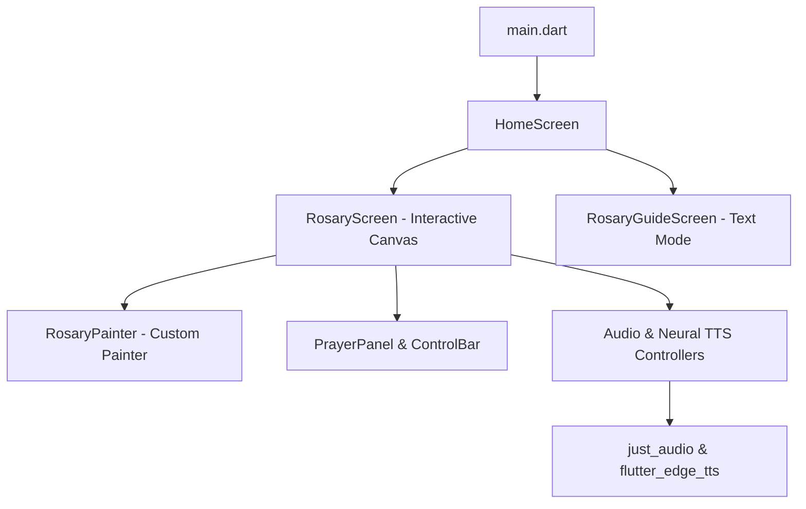

# 🌹 Santo Rosaryo (Holy Rosary App)

[](https://flutter.dev)
[](https://dart.dev)
[](LICENSE)

An elegant, interactive, and immersive bilingual Roman Catholic Rosary application built with **Flutter**. Designed with a medieval fantasy-inspired RPG aesthetic, it guides users through daily prayers with full audio text-to-speech narrations, progress tracking, and interactive custom-painted bead layouts.

---

## ✨ Features

- **Interactive Rosary Board**: A custom-drawn vector canvas showing the bead nodes. As the user moves through the prayers, beads dynamically light up, pulse, and track completion states.
- **Bilingual Text & Audio**: Full localizations for both **Tagalog/Filipino** and **English** prayers, including neural text-to-speech engine options:
  - 🇵🇭 **Tagalog**: Narrated by the high-quality `fil-PH-BlessicaNeural` voice.
  - 🇺🇸 **English**: Narrated by the expressive `en-US-JennyNeural` voice.
- **Auto-Play Mode**: Fully automated hands-free prayer session that reads the prayers out loud, tracks progress, and moves to the next bead seamlessly.
- **QuestUI Fantasy Design System**: Implemented using a dual-serif typography layout featuring the **Cinzel** (for ornate medieval headers) and **Spectral** (for parchment-like reading comfort) font stacks, rich golden accents, and deep red highlight styling.
- **Dynamic Mystery Scheduler**: Automatically loads the Roman Catholic Mysteries corresponding to the current day of the week (Joyful, Luminous, Sorrowful, or Glorious).
- **Dual Reading Modes**: 
  - **Interactive Mode**: Tap beads to manually navigate or use the player interface.
  - **Guide Mode**: A clean, book-like reading interface for scrolling through the complete set of prayers.

---

## 🛠️ Architecture & Tech Stack

The application follows a modular, feature-oriented structure in Flutter:



### Core Libraries Used
- [**flutter_edge_tts**](https://pub.dev/packages/flutter_edge_tts): High-quality neural voice synthesis utilizing edge services.
- [**just_audio**](https://pub.dev/packages/just_audio): Robust local audio streaming and player controller.
- [**path_provider**](https://pub.dev/packages/path_provider): Manages transient directories for caching audio files dynamically.
- [**google_fonts**](https://pub.dev/packages/google_fonts): Delivers the theme-critical typography layout dynamically.

---

## 🎨 Theme & Styling (QuestUI Style)

To match the traditional grandeur of historical prayer books, the UI leverages the **QuestUI Design System**:
- **Background**: Soft parchment (#F5E6D3) / Dark mystic wood (#1A0F0A)
- **Primary Accent**: Polished Gold (#CA8A04) with active golden-glow shadows
- **Secondary Accent**: Cardinal Red (#991B1B)
- **Surface**: Warm Card Brown (#2C1A10)
- **Fonts**: *Cinzel* for headlines, *Spectral* for body text

---

## 🚀 Setup & Installation

### Prerequisites
- Flutter SDK (version 3.22.x or higher recommended)
- Dart SDK (version 3.0 or higher)

### Run Locally

1. **Clone the repository:**
   ```bash
   git clone https://github.com/your-username/rosary.git
   cd rosary
   ```

2. **Install dependencies:**
   ```bash
   flutter pub get
   ```

3. **Run on a simulator or physical device:**
   ```bash
   flutter run
   ```

---

## 📝 License

This project is licensed under the MIT License - see the [LICENSE](LICENSE) file for details.
